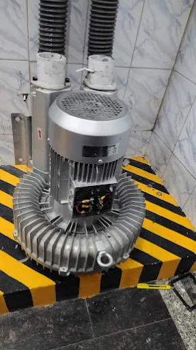

 <html lang="en" >
 <head >
 <meta charset="UTF-8" >
 <meta name="viewport" content="width=device-width, initial-scale=1.0" >
 <title > Excel Electricals | Motor Winding & Repair</title >
  
</head>
<body>

    <!-- HEADER --> <header> 
 ⚡ EXCEL ELECTRICALS 
 <nav> <a href="#home">Home</a> <a href="#motors">Motors</a> <a href="#winding">Winding</a> <a href="#services">Services</a> <a href="#contact">Contact</a> </nav> </header> <!-- HERO --> <section class="hero" id="home"> 
 <h1> ELECTRIC MOTOR WINDING & REPAIR </h1> 
 Professional electric motor rewinding, motor repair, stator winding, rotor service and motor component replacement in Choondy, Aluva. 
 <a class="button" href="tel:+918590259451"> 📞 CALL NOW </a> <a class="button" href="mailto:excelelectricalswork@gmail.com">Email </a> 
 
 <!-- ELECTRIC MOTOR IMAGE -->  
 </section> <!-- MOTOR PICTURES --> <section class="motor-gallery" id="motors"> 
 <small>ELECTRIC MOTOR</small> <h2>Motor Pictures</h2> 
 Electric motors, stators, rotors and motor components 
 
 

    
  

    
    

      <h3>Electric Motor</h3>
      
Electric motor repair and maintenance.

    

  

  

    
    

      <h3>Electric Motor</h3>
      
Motor service and electrical maintenance.

    

  

  

    
    

      <h3>Motor Stator</h3>
      
Stator and electrical motor components.

    

  

  

    
    

      <h3>Motor Stator</h3>
      
Stator and electrical motor compnment.

    

  

  

    
   

   <h3>motor Components</h3>
   
Motor parts and repair components.

  

 

   
 

    
   

   <h3>Motor Winding</h3>
   
Electrical winding and rewinding service.

  

 

 
 </section>
<!-- WINDING SECTION -->
<section class="winding" id="winding">
  

    <small>MOTOR REWINDING</small>
    <h2>Motor Winding</h2>
    
Professional winding and rewinding-related images

  

 
     

     

      
      <h3>Stator Winding</h3>
      
Professional electric motor winding service

    

    

    

      
      <h3>Motor Rewinding</h3>
      
Complete motor rewinding and repair work

    

  

  
</section> <!-- SERVICES --> <section class="services" id="services"> 
 <small>OUR SERVICES</small> <h2>Motor Services</h2> 
 
 
 <h3>⚡ Motor Winding</h3> 
 Motor winding and rewinding for electric motors. 
 
 
 <h3>⚙️ Motor Repair</h3> 
 Complete electrical and mechanical motor repair. 
 
 
 <h3>🔩 Bearing Change</h3> 
 Bearing inspection and replacement. 
 
 
 <h3>🔋 Capacitor Change</h3> 
 Motor capacitor testing and replacement. 
 
 
 <h3>🌀 Stator & Coil</h3> 
 Stator coil and winding related service. 
 
 
 <h3>🔧 Motor Parts</h3> 
 Motor component replacement and fitting. 
 
 
 </section> <!-- CONTACT --> <section class="contact" id="contact"> <h2>EXCEL ELECTRICALS</h2> 
 Motor Winding & Repair  Choondy, Aluva, Kerala 
 <a class="button" href="https://wa.me/918590259451" target="_blank"> 💬 WHATSAPP </a> <a class="button" href="tel:+918590259451"> 📞 CALL </a> <a class="button"  href="mailto:excelelectricalswork@gmail.com" >Email </a> <!-- FOOTER --> <footer> 
 © 2026 EXCEL ELECTRICALS 
 GSTIN/UIN:32AAGPX3837Q1ZZ 
 Motor Winding • Motor Repair • Choondy • Aluva 
 </footer>

